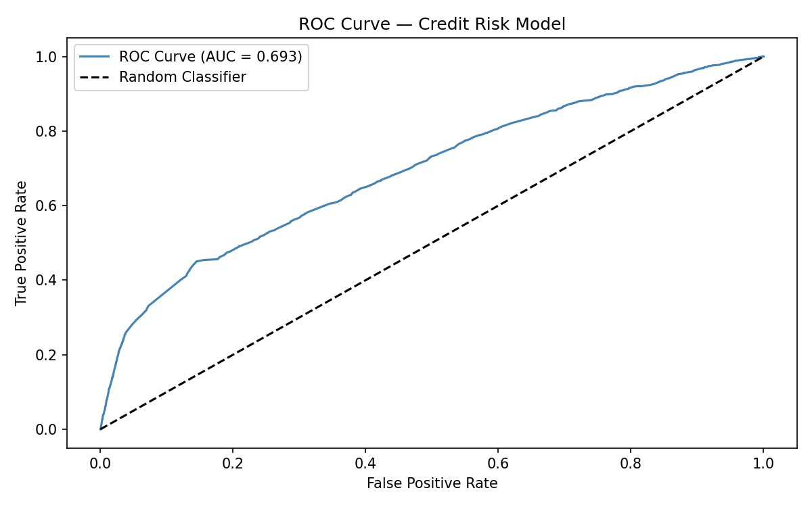
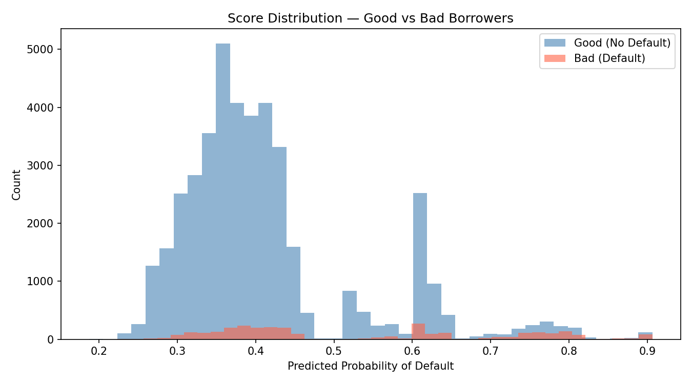

# Credit Risk Scorecard — Probability of Default Model

An end-to-end credit risk model built on 150,000 borrowers from the **Give Me Some Credit** dataset. The project replicates the core workflow used by bank credit risk teams: data cleaning, Weight of Evidence (WoE) transformation, logistic regression, and model validation using industry-standard metrics.

---

## Results

| Metric | Value | Industry Benchmark |
|--------|-------|--------------------|
| ROC-AUC | 0.6932 | > 0.65 |
| Gini Coefficient | 0.3864 | > 0.35 |
| KS Statistic | 0.3056 | > 0.30 |

All three metrics exceed industry benchmarks for an acceptable first-generation PD model.

---

## Methodology

### 1. Data Cleaning
- 150,000 borrowers, 10 predictor variables, 6.68% default rate
- Missing values in `MonthlyIncome` (29,731 records) and `NumberOfDependents` (3,924 records) imputed using median — median chosen over mean to avoid distortion from income outliers
- Outliers capped at the 99th percentile (winsorization) for `DebtRatio` and `MonthlyIncome`

### 2. Weight of Evidence (WoE) Transformation
Variables were binned using equal-frequency quantile binning and transformed to WoE, which measures the relative concentration of good vs bad borrowers in each bin:

```
WoE = ln(Distribution of Good / Distribution of Bad)
```

**Information Value (IV) by variable:**

| Variable | IV | Predictive Power |
|----------|----|-----------------|
| RevolvingUtilizationOfUnsecuredLines | 1.1128 | Very Strong |
| NumberOfTime30-59DaysPastDueNotWorse | 0.4685 | Strong |
| Age | 0.2406 | Medium |
| DebtRatio | 0.0769 | Weak |
| MonthlyIncome | 0.0749 | Weak |
| NumberOfOpenCreditLinesAndLoans | 0.0673 | Weak |

> **Note:** `NumberOfTimes90DaysLate` and `NumberOfTime60-89DaysPastDueNotWorse` showed near-zero IV under equal-frequency binning due to extreme class sparsity — 94%+ of borrowers recorded zero late payments. In production, monotonic or custom binning would isolate the non-zero values as a separate high-risk bin, recovering the predictive signal these variables carry in theory.

### 3. Class Imbalance — SMOTE
The 6.68% default rate creates severe class imbalance. SMOTE (Synthetic Minority Oversampling Technique) was applied to the training set, generating synthetic defaulter records by interpolating between existing defaulters rather than simple duplication. This expanded the training set from 105,000 to 195,964 records at a balanced 50/50 split.

### 4. Model — Logistic Regression
Logistic regression was chosen deliberately over more complex alternatives (XGBoost, neural networks) because:
- Regulators require explainable models for consumer lending decisions
- WoE-transformed inputs make coefficients directly comparable across variables
- Banks must be able to justify individual credit decisions to applicants

### 5. Model Validation
**Gini Coefficient** — primary metric reported by credit risk teams. Measures the model's ability to rank-order borrowers by risk. A Gini of 0.3864 means the model captures 38.6% of the maximum possible separation between good and bad borrowers.

**KS Statistic** — measures the maximum gap between the cumulative score distributions of good and bad borrowers. Used by banks to determine the optimal approval threshold.

**PSI (Population Stability Index)** — in this project, PSI was computed between the SMOTE-resampled training set and the holdout test set. The resulting PSI is inflated due to the synthetic composition of the training sample and is not interpretable as a drift metric in this context. In production, PSI would be computed by comparing score distributions across time periods (e.g. development sample vs. 12 months later).

---

## ROC Curve



---

## Score Distribution



The separation between good (blue) and bad (red) borrower score distributions is consistent with the KS statistic of 0.31 — the model meaningfully differentiates between the two populations.

---

## Tech Stack
- **Python 3.14**
- `pandas`, `numpy` — data manipulation
- `scikit-learn` — logistic regression, train/test split, ROC metrics
- `imbalanced-learn` — SMOTE
- `scipy` — KS statistic
- `matplotlib` — visualizations

---

## Files
| File | Description |
|------|-------------|
| `credit_risk_model.ipynb` | Full notebook with all code and outputs |
| `roc_curve.png` | ROC curve chart |
| `score_distribution.png` | Score distribution by good/bad borrowers |

---

## Dataset
[Give Me Some Credit — Kaggle](https://www.kaggle.com/c/GiveMeSomeCredit/data)
